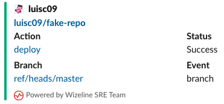

# Yasna
Yasna (Yet Another Slack Notifier Action) is a Github action that sends a message with the Status of the build to Slack.

Create a [Slack Incoming Webhook](https://api.slack.com/messaging/webhooks#create_a_webhook) before setting up this Action.

### Usage
Include it as a step in your workflow file

```yaml
- name: Workflow succeeded
      if: success()
      env:
        SLACK_WEBHOOK: ${{ secrets.SLACK_WEBHOOK }}
        STATUS: success
        GITHUB_TOKEN: ${{ github.token }}
      uses: wizeline-sre/yasna@main
```

```yaml
- name: Notification
      env:
        SLACK_WEBHOOK: ${{ secrets.SLACK_WEBHOOK }}
        STATUS: ${{ job.status }}
        GITHUB_TOKEN: ${{ github.token }}
      uses: wizeline-sre/yasna@main
```




The environments variables required to work are:
* SLACK_WEBHOOK: The URL of your configured Incoming Webhook.
* STATUS: Can be fail or success.
* GITHUB_TOKEN: This is the automatically created [Github token](https://docs.github.com/en/actions/reference/authentication-in-a-workflow#about-the-github_token-secret), it is consumed by the Action to look for PR commits association.

### Local Development
For local development:
1. (Optional) Set up a virtual environment.
    ```shell
    python -m venv .pyenv
    ```
1. Set up a [Slack Incoming Webhook](https://api.slack.com/messaging/webhooks#create_a_webhook)
1. Set up a `.env` using the `.example.env` as template and update the values accordingly.
   ```shell
   cp .example.env .env
   ```
1. Start Coding!

## License
This Github Action is distributed under the [MIT License ](https://opensource.org/licenses/MIT), see [LICENSE](./LICENSE) for more information.